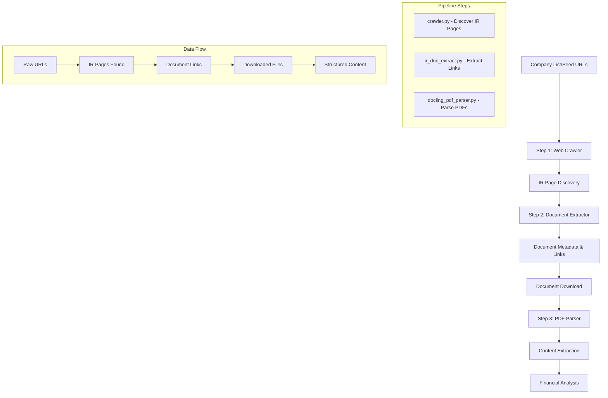

# Investment Report Extractor

A comprehensive end-to-end pipeline for extracting, processing, and analyzing investment reports from company investor relations pages. This system combines web scraping, document processing, SEC validation, and intelligent PDF parsing to create a complete solution for financial document extraction.

## 🚀 Overview

The Investment Report Extractor is a sophisticated system that automates the entire workflow from discovering company investor relations pages to extracting and analyzing financial documents. It's designed to handle the complexity of modern IR websites while providing robust error handling and validation.

### Key Features

- **🌐 Multi-Modal Web Scraping**: Selenium + Playwright for dynamic content
- **🤖 AI-Powered Document Classification**: LLM-based intent understanding
- **📊 SEC Validation**: Automated validation against SEC EDGAR database
- **📄 Advanced PDF Processing**: Docling integration for intelligent document parsing
- **🔄 Queue-Based Crawling**: Priority-based navigation with state persistence
- **📈 Financial Metrics Extraction**: Automated extraction of revenue, profit, and other metrics
- **🏗️ Modular Architecture**: Pluggable components for different use cases

## 📁 Project Structure

```
investment-report-extractor/
├── 📁 pipelines/                    # Core processing modules
│   ├── 🔧 crawler.py               # Queue-based web crawler
│   ├── 🕷️ scraper.py               # Single-page scraping engine
│   ├── 📄 ir_doc_extract.py       # IR document extraction
│   ├── 📊 docling_pdf_parser.py   # PDF processing with Docling
├── 📁 notebooks/                   # Development and analysis
│   ├── 📓 Homepage_ir_extract.ipynb # IR page discovery
│   ├── 📓 text_extr.ipynb          # Document extraction
│   ├── 📓 docling_pdf_parser.ipynb # PDF processing
├── 📁 data/                        # Data storage
│   ├── 📁 reports/                 # Downloaded documents
│   ├── 📁 documents/               # Extracted metadata
│   └── 📁 docling_output/         # PDF processing results
├── 📁 dags/                        # Apache Airflow workflows
├── 📁 schemas/                     # Data schemas
└── 📁 tests/                       # Test suites
```

## 🏗️ Architecture

### System Components



### Data Flow

1. **Input**: Company list or seed URLs
2. **Step 1 - Crawling**: Navigate websites to discover IR pages (`crawler.py`)
3. **Step 2 - Extraction**: Extract document metadata and links from IR pages (`ir_doc_extract.py`)
4. **Step 3 - Download**: Download actual document files
5. **Step 4 - Processing**: Parse PDFs with Docling (`docling_pdf_parser.py`)
6. **Step 5 - Analysis**: Extract financial metrics and structured data
7. **Output**: Structured data in JSON/CSV formats

## 🛠️ Installation

### Prerequisites

- Python 3.13+
- Chrome/Chromium browser
- Git

### Setup

1. **Clone the repository**:
```bash
git clone https://github.com/yourusername/investment-report-extractor.git
cd investment-report-extractor
```

2. **Create virtual environment**:
```bash
python -m venv .venv
source .venv/bin/activate  # On Windows: .venv\Scripts\activate
```

3. **Install all dependencies** (includes development tools):
```bash
pip install -r requirements.txt
```

4. **Install Playwright browsers**:
```bash
playwright install
```

5. **Install Docling browsers** (for PDF processing):
```bash
playwright install chromium
```

> **Note**: The `requirements.txt` file includes all dependencies (production, development, and testing) in one consolidated file for easier management.

## 🚀 Quick Start

### 1. Web Crawling (Discover IR Pages)

Start by crawling and discovering investor relations pages:

```bash
cd pipelines
python crawler.py --seed-url "https://www.cnbc.com/dow-30/" --output ../data/dow30_ir_pages.json
```

### 2. Document Extraction (Extract Document Links)

Extract document metadata and links from IR pages:

```bash
python ir_doc_extract.py --input ../data/dow30_companies_with_ir.json --output ../data/documents/all_documents.json
```

### 3. PDF Processing (Parse Downloaded Documents)

Process downloaded PDFs with Docling for content extraction:

```bash
python docling_pdf_parser.py --reports-dir ../data/reports --output-dir ../data/docling_output --sample-size 2
```

## 📋 Detailed Usage

### Step 1: Web Crawler (`crawler.py`)

The crawler uses a priority queue system to navigate IR websites intelligently and discover investor relations pages:

```python
from pipelines.crawler import CrawlerConfig, crawl_dow30_ir_pages

# Configure crawler
config = CrawlerConfig(
    max_depth=4,
    max_concurrent_workers=5,
    max_documents=200,
    scraping_mode="exact"  # or "guidance"
)

# Run crawler to discover IR pages
results = await crawl_dow30_ir_pages(config=config)
```

**Key Features**:
- **Priority-based navigation**: Important pages processed first
- **State persistence**: Resume interrupted crawls
- **Parallel processing**: Multiple workers for efficiency
- **Intent-driven**: AI-powered page classification
- **IR page discovery**: Finds investor relations URLs for companies

### Step 2: Document Extractor (`ir_doc_extract.py`)

Extract document metadata and links from discovered IR pages:

```python
from pipelines.ir_doc_extract import IRDocumentExtractor, DocumentDownloader

# Extract documents from IR pages
extractor = IRDocumentExtractor(debug=True)
documents = extractor.extract_documents(ir_url, ticker, company_name)

# Download actual document files
downloader = DocumentDownloader()
downloader.download_company_documents(ticker, company_name, documents)
```

**Key Features**:
- **Dynamic content handling**: JavaScript-heavy sites
- **Document classification**: Automatic type detection
- **Deduplication**: Global URL deduplication
- **Latest quarterly identification**: Find most recent reports
- **File downloading**: Downloads actual PDF/document files

### Step 3: PDF Parser (`docling_pdf_parser.py`)

Process downloaded PDF documents with intelligent content extraction:

```python
from pipelines.docling_pdf_parser import DoclingPDFParser

# Initialize parser
parser = DoclingPDFParser("../data/reports", "../data/docling_output")

# Discover and process downloaded documents
documents = parser.discover_documents()
filtered_docs = parser.filter_documents(documents, sample_size=2)
results = parser.process_documents(filtered_docs)
output_files = parser.export_results(results)
```

**Key Features**:
- **Advanced PDF parsing**: OCR, table extraction, metadata
- **Financial metrics extraction**: Revenue, profit, earnings
- **Structured output**: JSON, CSV formats
- **Error handling**: Fallback mechanisms
- **Content analysis**: Extract text, tables, and structured data

## 🔧 Configuration

### Crawler Configuration

```python
@dataclass
class CrawlerConfig:
    max_depth: int = 4                    # Maximum crawl depth
    max_concurrent_workers: int = 5      # Parallel workers
    max_documents: int = 200             # Document limit
    timeout_seconds: int = 600            # Request timeout
    priority_threshold: float = 0.5      # Priority threshold
    rate_limit_delay: float = 1.0        # Rate limiting
    scraping_mode: str = "exact"          # "exact" or "guidance"
    terminal_detection_mode: str = "rule" # "rule" or "llm"
```

### Document Extractor Configuration

```python
extractor = IRDocumentExtractor(
    debug=True,                    # Enable debug logging
    max_sections=20,              # Maximum sections to process
    request_delay=(2, 4),         # Random delay between requests
    max_retries=2                 # Retry attempts
)
```

## 📊 Data Formats

### Input Format

```json
[
  {
    "ticker": "AAPL",
    "company_name": "Apple Inc.",
    "investor_relations_url": "https://investor.apple.com"
  }
]
```

### Document Output Format

```json
{
  "title": "Q3 2024 Earnings Report",
  "url": "https://investor.apple.com/...",
  "document_type": "10-Q Quarterly Report",
  "publication_date": "2024-07-25",
  "file_extension": "pdf",
  "relevance_score": 0.95,
  "extracted_year": 2024,
  "extracted_quarter": 3,
  "metadata": {
    "ticker": "AAPL",
    "company": "Apple Inc."
  }
}
```

### PDF Processing Output

```json
{
  "document_info": {
    "file_name": "Q3_2024_Earnings.pdf",
    "document_type": "10-Q Quarterly Report",
    "file_size_mb": 2.5
  },
  "extraction_result": {
    "success": true,
    "text_content": "# Apple Inc. Q3 2024 Earnings...",
    "tables": [
      {
        "caption": "Financial Summary",
        "content": "Revenue: $81.4B..."
      }
    ],
    "metadata": {
      "page_count": 45,
      "language": "en"
    }
  }
}
```

### Test Individual Components

```python
# Test crawler
from pipelines.crawler import test_crawler
await test_crawler()

# Test PDF parser
from pipelines.docling_pdf_parser import DoclingPDFParser
parser = DoclingPDFParser("test_reports", "test_output")
# ... run tests
```

## 📈 Performance

### Benchmarks

- **Document Extraction**: ~2-4 seconds per company
- **PDF Processing**: ~5-10 seconds per document
- **SEC Validation**: ~1-2 seconds per document
- **Memory Usage**: ~500MB for 100 companies

### Optimization Tips

1. **Batch Processing**: Use `extract_in_batches()` for large datasets
2. **Parallel Processing**: Increase `max_concurrent_workers`
3. **Caching**: Enable state persistence for resumable crawls
4. **Filtering**: Use document type filters to reduce processing

## 🔍 Troubleshooting

### Common Issues

1. **Chrome Driver Issues**:
```bash
# Update Chrome and ChromeDriver
pip install --upgrade selenium
```

2. **Playwright Installation**:
```bash
playwright install chromium
```

3. **Docling Backend Errors**:
```bash
# The script automatically falls back to basic configuration
# Check logs for specific error messages
```

4. **Memory Issues**:
```bash
# Reduce batch size or sample size
python docling_pdf_parser.py --sample-size 1
```

### Debug Mode

Enable debug logging for detailed information:

```bash
python ir_doc_extract.py --debug
python docling_pdf_parser.py --verbose
```


### Integration with Airflow

```python
# Use the DAG for scheduled extraction
from dags.ir_extraction_dag import ir_extraction_dag
```

## 📚 API Reference

### Core Classes

#### `IRDocumentExtractor`
- `extract_documents(ir_url, ticker, company_name)`: Extract documents from IR page
- `identify_latest_report(documents)`: Find latest report
- `close()`: Clean up resources

#### `DocumentDownloader`
- `download_company_documents(ticker, company_name, documents)`: Download documents
- `download_all_companies(input_json_path)`: Download all companies
- `print_summary()`: Show download statistics

#### `DoclingPDFParser`
- `discover_documents()`: Find PDF documents
- `filter_documents(documents, **filters)`: Filter documents
- `process_documents(documents)`: Process PDFs
- `export_results(results)`: Export to files

#### `CrawlerConfig`
- `max_depth`: Maximum crawl depth
- `max_concurrent_workers`: Parallel workers
- `scraping_mode`: "exact" or "guidance"
- `terminal_detection_mode`: "rule" or "llm"

## 🤝 Contributing

1. Fork the repository
2. Create a feature branch
3. Make your changes
4. Add tests
5. Submit a pull request

### Development Setup

```bash
# All dependencies (including dev tools) are in requirements.txt
pip install -r requirements.txt

# Run linting
flake8 pipelines/
```

## 📄 License

This project is licensed under the MIT License - see the [LICENSE](LICENSE) file for details.

## 🙏 Acknowledgments

- **Docling**: Advanced PDF processing
- **Playwright**: Web automation
- **Selenium**: Web scraping
- **Apache Airflow**: Workflow orchestration
- **SEC EDGAR**: Financial data validation

## 📞 Support

For questions and support:

- **Issues**: [GitHub Issues](https://github.com/yourusername/investment-report-extractor/issues)
- **Discussions**: [GitHub Discussions](https://github.com/yourusername/investment-report-extractor/discussions)

---
